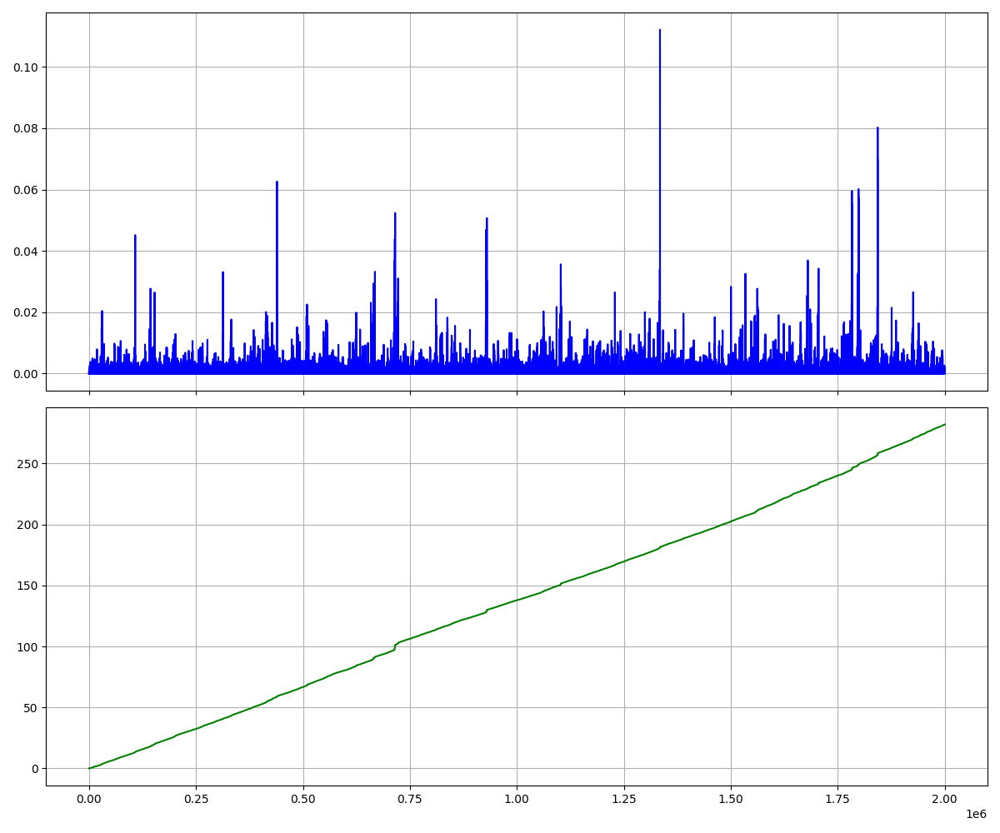

# 基于趋势线的加密货币交易策略

## 包括实时计算与回测优化参数部分

具体计算方式可通过src中函数查看。主要为计算极点处的趋势与最新价格的关系，寻找可能的转折点

效率图如上，线性复杂度，确保回测效率足够：横轴上午为单个蜡烛，下图为蜡烛累计数量，两个的纵坐标为时间（秒）

公开该仓库，以此纪念2024.9-2025.4的研究。我为此放弃了很多东西，尽管没做出来，但也从中学到了很多，如果你可以进一步优化，敬请使用它：）

现在想想这个算法确实有很多缺陷，虽然当时已经有一些看出来了，但是还是蒙头做，无论如何，也算是研究了一个快速计算的算法出来。虽然交易算法可能本身没用，但是这个计算方案也许可以被用在其他地方。

最后，如果你真的用在了什么地方，希望你能告诉我一声，让我知道这个算法有用武之地XD
